# Semana 07 — Fail2Ban, forense web y mi primer hack ético

Cerré la pregunta que venía arrastrando desde la semana 06: cómo se desbanea una IP sola. De ahí salté a leer logs de un servidor web real como un analista, y terminé haciendo mi primer room de TryHackMe. Tres cosas distintas, una misma sesión, con capturas de todo.


## 01. Fail2Ban: cómo desbanea solo

En la semana 06 armé un detector de SSH brute force que bloqueaba con UFW, pero no desbloqueaba solo. La pregunta era: ¿cómo hace Fail2Ban para banear por tiempo limitado y soltar la IP sin que nadie toque nada? La respuesta me sorprendió: **iptables no tiene timeout nativo**. Fail2Ban guarda el timestamp del ban en una base SQLite, y un scheduler propio compara cada tanto si `now - ban_timestamp > bantime`. Cuando se pasa, borra la regla de iptables. El unban no es magia de iptables, es lógica de Fail2Ban.

Comparado con mi script manual, la diferencia de robustez es clara: monitorea en tiempo real con inotify en vez de correr por cron, usa filtros configurables por regex, y persiste el estado.


## 02. jail.conf vs jail.local — la regla de oro

Acá me comí dos errores seguidos, y los dos enseñaron. Una **jail** es la regla completa para un servicio: qué log mirar, qué regex, cuántos intentos y cuánto banear. La regla de oro es **nunca editar `jail.conf`**: cuando `apt upgrade` actualiza el paquete lo sobreescribe sin avisar y tus cambios desaparecen. Todo va en `jail.local`, que Fail2Ban mergea con precedencia.

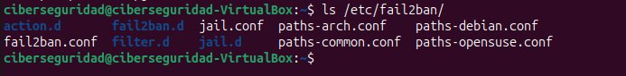

El segundo error fue más sutil: había copiado todo `jail.conf` dentro de `jail.local` y agregado `[sshd]` al final. Fail2Ban no levantó. Lo diagnostiqué corriéndolo en **foreground** (`fail2ban-server -xf start`), que muestra el error que no aparece en los logs normales:

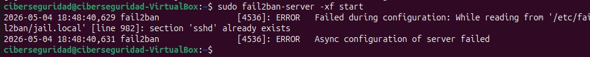

La solución fue tirar todo y dejar un `jail.local` minimalista, solo con mis decisiones:

```bash
[sshd]
enabled = true
port = ssh
logpath = /var/log/auth.log
maxretry = 3
findtime = 600
bantime = 3600
```

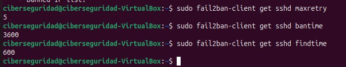

Para ver el ciclo entero puse `bantime=60` e `ignoreself=false`, generé intentos fallidos desde localhost y lo miré pasar en vivo:

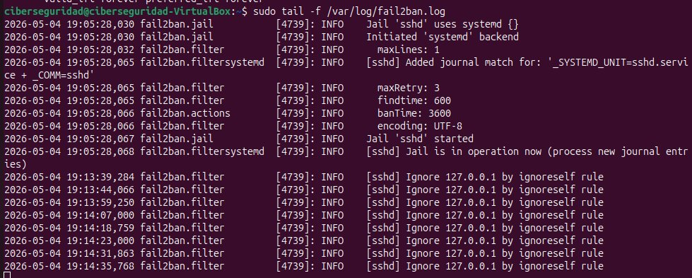


## 03. Forense de logs web con Apache

Segundo bloque: monté Apache no para servir nada, sino para **generar logs reales y atacarlos yo mismo**, reproduciendo los escenarios de TryHackMe. El log principal es `access.log`: una línea por request.

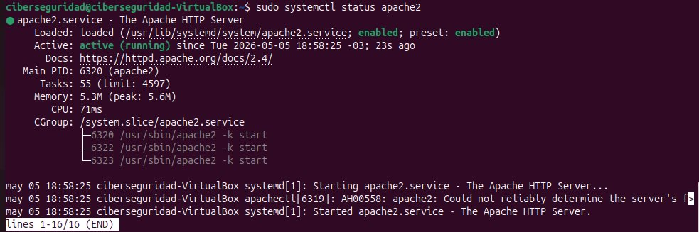

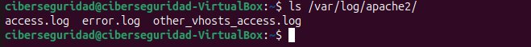

Aprendí a leer la anatomía de una línea: IP del cliente, timestamp, método + ruta + protocolo, status code, bytes, referrer y **User-Agent**. Ese último campo es el que delata la herramienta que hizo el request.

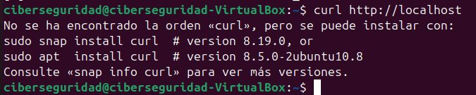

Los status codes cambian de significado cuando pensás en seguridad: un `200` en `/admin` es alerta; una ráfaga de `404` es un escaneo de directorios. Y hasta el tamaño en bytes es indicador — un `200` devuelve la página completa, un `404` solo la de error.

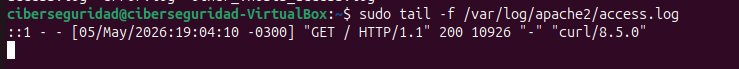


## 04. Simular y detectar un escaneo de directorios

Un atacante no sabe qué rutas existen, así que herramientas como gobuster prueban miles automáticamente. Lo simulé con un loop de `curl` contra rutas sensibles, y después lo cacé en los logs con cuatro comandos de `awk`.

```bash
# simular el escaneo
for ruta in admin login phpmyadmin backup config .env wp-admin; do
  curl -s -o /dev/null http://localhost/$ruta
done
```

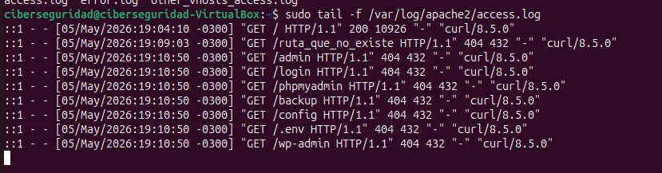

El triaje con `awk`: extraer un campo → ordenar → contar repetidos → mostrar de mayor a menor. Cuatro variantes cubren casi todo.

```bash
# distribución de status codes
awk '{print $9}' access.log | sort | uniq -c | sort -rn

# IPs con más requests
awk '{print $1}' access.log | sort | uniq -c | sort -rn

# User-Agents sospechosos (sqlmap, gobuster, nikto)
awk -F'"' '{print $6}' access.log | sort | uniq -c | sort -rn
```

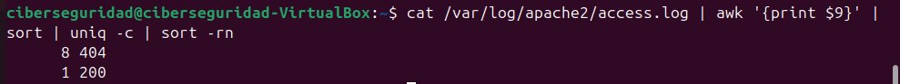

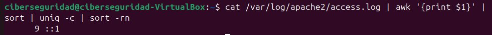

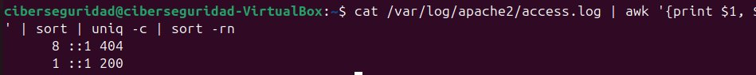

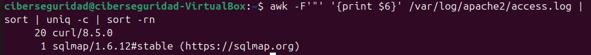


## 05. TryHackMe: primer room completado

Con esa base cerré la sesión haciendo mi primer room: **Offensive Security Intro**. Lo elegí en inglés a propósito — toda la industria (CVEs, writeups, herramientas, certificaciones) opera en inglés y no tiene sentido re-aprender los términos después.

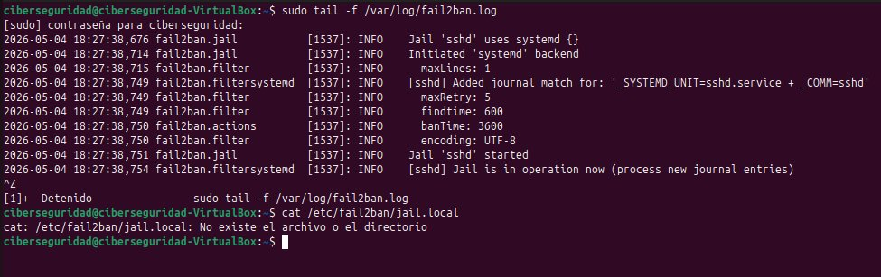

El room me hizo usar `dirb` para encontrar páginas ocultas en una app bancaria falsa — **exactamente lo mismo que había simulado a mano con el loop de curl**, pero con una wordlist de miles de rutas. Encontré un panel de administración sin protección y transferí fondos: un **IDOR** (Insecure Direct Object Reference), una función que debería estar restringida pero está accesible sin autenticación. Flag: `BANK-HACKED`. Primer hack ético, en un entorno legal y controlado.


## 06. Lo que no entendía al principio

| Confusión | Cómo lo resolví |

|---|---|

| Cómo hace iptables para desbanear solo por tiempo | No lo hace: Fail2Ban guarda el timestamp en SQLite y un scheduler propio borra la regla |

| Por qué Fail2Ban no levantaba después de editar | Había copiado todo `jail.conf` en `jail.local` y quedó `[sshd]` duplicado — lo vi en foreground |

| Por qué un `200` puede ser peor que un `404` | Un `200` en una ruta sensible significa que existe y respondió; el `404` es que no está |

| Qué es un IDOR | Una función restringida que quedó accesible sin autenticación — acceso directo a algo que no debería |


## 07. Conexión con el mundo profesional

Fail2Ban e iptables son hardening real de cualquier servidor expuesto. El triaje de `access.log` con `awk` es pan de cada día en un SOC L1 — detectar escaneos, User-Agents de herramientas ofensivas, ráfagas de errores. Y haber atacado un IDOR de un lado me deja saber qué log mirar del otro. Ese ida y vuelta ataque/defensa es lo que quiero mostrar en el portfolio.


## 08. Pregunta pendiente y próximo paso

La ruta quedó clara: seguir el path de TryHackMe (Cyber Security 101 → Jr Penetration Tester → SOC Level 1) y después HackTheBox. Pero antes de seguir sumando salas, tocaba ordenar la casa: **gestionar bien mis propias credenciales** con un gestor de contraseñas serio.

— fv
